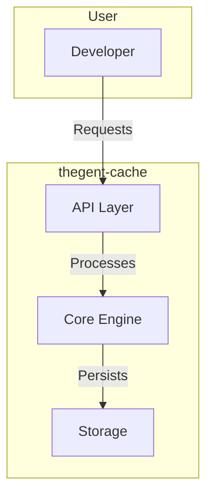

# thegent-cache User Journeys

> Visual workflows for Infrastructure component

## Available Journeys

| Journey | Duration | Description |
|---------|----------|-------------|
| [Quick Start](./quick-start) | < 5 min | Get started with thegent-cache |
| [Core Workflow](./core-workflow) | 10 min | Primary use case |
| [Advanced Setup](./advanced-setup) | 20 min | Production configuration |

## Architecture Overview

## Performance Targets

| Operation | P50 | P99 |
|-----------|-----|-----|
| Initialize | < 10ms | < 50ms |
| Process | < 100ms | < 500ms |
| Query | < 50ms | < 200ms |
